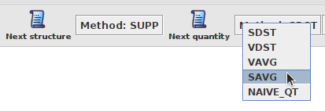

# QAlloy - Quantitative Solution Iteration

This repository includes some examples of QAlloy models, inserted in both *integer* and *fuzzy* domains, a script to benchmark QAlloy,  folder *results* containing the results of evaluating the performance of QAlloy's solution iteration operations against these examples (considering a 1 minute timeout in-between solutions), the folder *instances* which will store each solution produced throughout the benchmarking process and *tables.md* containing tables compiled from the resulting data. 

The benchmark is performed using the Max-SMT Solver $\nu\text{Z}$, evaluating the LEX/BOX/PARETO multi-objective optimization priorities for each affected operation, and uses the Gödelian triangular norm for those models set in the fuzzy domain.

## Solution Iteration Operations

The quantitative solution iteration operations being evaluated maximize the distance according to a specific goal.
The following table presents the operation, their identifier in QAlloy and in the *.csv* files, as well as a brief description. 
$\mathsf{next}^{\emptyset}\_{S}$ and $\mathsf{next}^{B}\_{S}$ focus in structure-level changes, while from the operations from $\mathsf{next}^{\emptyset}_{Q}$ onwards maintain the underlying structure and produce changes in the quantities of each relation.

| Operation                         | Goal            | Id         | Description |
| ---                               | ---             | ---        | --- |
| $\mathsf{next}$                   |                 | `NAIVE`    | The default iteration approach 
| $\mathsf{next}^{\emptyset}_{S}$   |                 | `SUPP`     | Finds different solutions structure-wise, and never equal to a previously found one|
| $\mathsf{next}^{B}_{S}$           |                 | `MAXSUPP`  | Maximizes changes in structure |
| $\mathsf{next}^{\emptyset}_{Q}$   |                 | `NAIVE_QT` | The baseline for quantity-level operations, only ensuring that the underlying structure remains unchanged|
| $\mathsf{next}^{\mathcal{S}}_{Q}$ | $\mathsf{SDst}$ | `SDST`     | Maximizes the distance to the previous solution(s)
| $\mathsf{next}^{\mathcal{S}}_{Q}$ | $\mathsf{VDst}$ | `VDST`     | Maximizes the distance between each primary variable and their previous assignment(s)
| $\mathsf{next}^{\mathcal{S}}_{Q}$ | $\mathsf{VAvg}$ | `VAVG`     | Maximization of the average measured for each previous value of each variable |
| $\mathsf{next}^{\mathcal{S}}_{Q}$ | $\mathsf{SAvg}$ | `SAVG`     | The distance to the average of the previous solutions is maximized |

## Solution Iteration in the QAlloy Analyzer

The version of [QAlloy](https://github.com/pf7/QAlloy-QSI/releases/tag/v1.0.0) included in this repository, comes equipped with quantitative iteration operations. Instead of the ```Next``` button from standard Alloy, the user may request changes at structure-level by selecting ```Next Structure```, while ```Next Quantity``` will attempt to find a new distinct solution, but with the same underlying structure.

For the purposes of this evaluation, this prototype version allows the user to select which iteration operation to be used in ```Next Structure```  and ```Next Quantity```, as shown in the following image:



## Benchmark

### Files

The *.csv* files produced for each command are organized as follows:
* **Command** &ndash; the command name
* **Domain** &ndash; Either ```Integer``` or ```Fuzzy```, depending on the domain at hand
* **Solver** &ndash; ```z3``` for this evaluation, representing the $\nu\text{Z}$ Max-SMT solver
* **Iteration Operation** &ndash; the [iteration operation](#solution-iteration-operations) used
* **Priority** &ndash; ```None``` if the operation does not generate multiple optimization goals, and ```LEX```, ```BOX``` or ```PARETO``` otherwise
* **SAT** &ndash; the outcome of command for that iteration, can either be ```SAT```, ```UNSAT```, ```UNKNOWN``` or ```INFINITE```
* **Solution nº** &ndash; indicates the number of the solution, with $0$ representing the initial one, and from $1$ onwards the solutions determined according to the iteration operation considered
* **Response Time(ms)** &ndash; solving time, in milliseconds

A model originates a directory within ```instances/``` with the same name of the *.als* file, and each *.xml* file within, represents a satisfiable QAlloy solution. The name of the files is of the form *CMD_OPERATION_N.xml*, where *CMD* indicates the command name, *OPERATION* the iteration operation used and *N* the iteration number. 

*tables.md* presents several tables summarizing the data organized in the previous folders.

### Usage

To run the benchmark, first place the QAlloy JAR (provided [here](https://github.com/pf7/QAlloy-QSI/releases/tag/v1.0.0)) in the current folder, then execute the ```benchmark.sh``` script as follows:
```
./benchmark.sh -n 3 -t 30000 models/supermarket.als models/sanchez.als
```
Which will do 3 iterations (after the first *satisfiable* solution) per command in the ```supermarket.als``` and in ```sanchez.als``` files, with a 30 second timeout, between each iteration. The folders ```results/``` and ```instances/``` will be created in the current directory, which will contain the results for each model written in *.csv* and *.xml* format, respectively. In this case,  ```supermarket.csv``` and ```sanchez.csv``` will be produced in ```results/```, alongside a series of xml files placed in the directory ```instances/supermarket``` and ```instances/sanchez```.

The QAlloy JAR is assumed to be named ```QAlloy.jar``` and otherwise can be specified using the option ```-j```.

For the full options run,
```
./benchmark.sh -h
```

By default, the benchmark will do 10 iterations per operation, per multi-objective combination (if applicable) and per cmd of every .als model specified, with a 1 minute timeout in-between solutions.

